[ 简体中文 ](README_zh.md)

# AI Magic: From Blog to Podcast in Under 100 Lines of Code 🪄

What if I told you that you could build an AI that reads any blog post and turns it into a podcast, using **less than 100 lines of Python code**? ✨ It sounds like magic, but it's a reality!

I want to share a fun project I've been working on: The **AI Blog to Podcast Agent**. It’s a simple web app that lets you drop in a URL and get a ready-to-listen podcast episode in seconds. 🎧

---

---

## The Secret Sauce: Just 4 Key Ingredients 🌶️

The most incredible part of this project is its simplicity. It’s built on the shoulders of giants, using a few powerful tools that do all the heavy lifting. The entire web app is just a single 101-line Python file!

Here’s the tech stack that makes it possible:

-   **Streamlit** 🎈: The hero for creating the web UI. It lets you build interactive apps with pure Python, no web development experience needed!
-   **Firecrawl** 🔥: The reliable data scout. It takes a URL, intelligently scrapes the article content, and leaves all the junk (like ads and sidebars) behind.
-   **OpenAI (GPT-5.1)** 🧠: The brilliant summarizer. It reads the scraped text and crafts a short, engaging, and conversational summary—the perfect script for our podcast.
-   **ElevenLabs** 🗣️: The voice actor. This API is pure magic, turning our text script into an incredibly natural-sounding human voice.

## The Conductor: How the `agno` Agent Works 🤖

So, how do all these tools work together without turning into a tangled mess of code? The answer is the **`agno` Agent** framework.

Think of the agent as a smart project manager. We don't tell it *how* to do its job step-by-step. Instead, we just:
1.  Give it a **goal** (e.g., "Create a podcast summary from this URL").
2.  Give it a **toolbox** (e.g., Firecrawl for web scraping).

The agent then figures out the rest! It sees the URL, realizes it needs to scrape it first, and automatically picks the `Firecrawl` tool from its toolbox. It’s a smarter way to build applications that feel less like programming and more like giving instructions.

Here’s a simple visual of the workflow:

```mermaid
graph TD;
    A["Start with a Blog URL" 🌐] --> B["Firecrawl scrapes the article" 🔥];
    B --> C["OpenAI GPT-5.1 summarizes the text" 🧠];
    C --> D["ElevenLabs converts summary to speech" 🗣️];
    D --> E[("Final Podcast Audio is ready!" 🎧)];
```



## Take a Look at the App! 💻

The UI is super simple. All the magic is packed into this clean interface.


## The Magic Code: All 101 Lines 📜
To prove how simple this is, here is the *entire* Python script. All the functionality, from the UI to the AI agent logic to the audio generation, is right here.

```python
import os
from uuid import uuid4
from agno.agent import Agent
from agno.run.agent import RunOutput
from agno.models.openai import OpenAIChat
from agno.tools.firecrawl import FirecrawlTools
from elevenlabs import ElevenLabs
import streamlit as st

# Streamlit Setup
st.set_page_config(page_title="📰 ➡️ 🎙️ Blog to Podcast", page_icon="🎙️")
st.title("📰 ➡️ 🎙️ Blog to Podcast Agent")

# API Keys (Runtime Input)
st.sidebar.header("🔑 API Keys")
# OpenAI API Compatible Model Settings
st.sidebar.subheader("OpenAI API Compatible Model")
openai_api_key = st.sidebar.text_input("API Key", type="password")
openai_base_url = st.sidebar.text_input("Base URL", value="https://api.openai.com/v1")
openai_model_id = st.sidebar.text_input("Model ID", value="gpt-5.1")
# Other API Keys
st.sidebar.subheader("Other Services")
elevenlabs_key = st.sidebar.text_input("ElevenLabs API Key", type="password")
firecrawl_key = st.sidebar.text_input("Firecrawl API Key", type="password")

st.sidebar.markdown("---")
st.sidebar.markdown("### Get your API Keys:")
st.sidebar.markdown("- [OpenAI API Keys](https://platform.openai.com/api-keys)")
st.sidebar.markdown("- [ElevenLabs](https://elevenlabs.io/)")
st.sidebar.markdown("- [Firecrawl](https://www.firecrawl.dev/)")

# Blog URL Input
url = st.text_input("Enter Blog URL:", "")

# Generate Button
if st.button("🎙️ Generate Podcast", disabled=not all([openai_api_key, elevenlabs_key, firecrawl_key])):
    if not url.strip():
        st.warning("Please enter a blog URL")
    else:
        with st.spinner("Scraping blog and generating podcast..."):
            try:
                # Set API keys
                os.environ["FIRECRAWL_API_KEY"] = firecrawl_key
                
                # Create agent for scraping and summarization
                agent = Agent(
                    name="Blog Summarizer",
                    model=OpenAIChat(
                        id=openai_model_id,
                        api_key=openai_api_key,
                        base_url=openai_base_url,
                    ),
                    tools=[FirecrawlTools()],
                    instructions=[
                        "Scrape the blog URL and create a concise, engaging summary (max 2000 characters) suitable for a podcast.",
                        "The summary should be conversational and capture the main points."
                    ],
                )
                
                # Get summary
                response: RunOutput = agent.run(f"Scrape and summarize this blog for a podcast: {url}")
                summary = response.content if hasattr(response, 'content') else str(response)
                
                if summary:
                    # Initialize ElevenLabs client and generate audio
                    client = ElevenLabs(api_key=elevenlabs_key)
                    
                    # Generate audio using text_to_speech.convert
                    audio_generator = client.text_to_speech.convert(
                        text=summary,
                        voice_id="JBFqnCBsd6RMkjVDRZzb",
                        model_id="eleven_multilingual_v2"
                    )
                    
                    # Collect audio chunks if it's a generator
                    audio_chunks = []
                    for chunk in audio_generator:
                        if chunk:
                            audio_chunks.append(chunk)
                    audio_bytes = b"".join(audio_chunks)
                    
                    # Display audio
                    st.success("Podcast generated! 🎧")
                    st.audio(audio_bytes, format="audio/mp3")
                    
                    # Download button
                    st.download_button(
                        "Download Podcast",
                        audio_bytes,
                        "podcast.mp3",
                        "audio/mp3"
                    )
                    
                    # Show summary
                    with st.expander("📄 Podcast Summary"):
                        st.write(summary)
                else:
                    st.error("Failed to generate summary")
                    
            except Exception as e:
                st.error(f"Error: {e}")
```

## What's Next? 🚀

This 100-line project is just the beginning! Here are a few ideas to take it to the next level:
-   **Playlist Feature**: Convert multiple URLs at once and create a playlist.
-   **Voice Selection**: Add a dropdown to choose different voices from ElevenLabs.
-   **Language Translation**: Add an agent step to translate the article before generating the audio.

This project is a fantastic demonstration of how modern AI tools let us build powerful things, fast. It’s all about creatively combining the right services.

## How to Run It Yourself 🚀
Ready to try it? It's easy to get this running on your own computer.

**1. Prerequisites:**
-   Make sure you have **Python 3.8+** installed.
-   You will need API keys from:
    -   [OpenAI](https://platform.openai.com/api-keys)
    -   [ElevenLabs](https://elevenlabs.io/)
    -   [Firecrawl](https://www.firecrawl.dev/)

**2. Installation:**
First, clone the project repository and install the required packages.
```bash
# Clone the repository (use the actual project URL)
git clone https://github.com/tongzm/ai_blog_to_podcast_agent.git

# Navigate into the project directory
cd ai_blog_to_podcast_agent

# Install the dependencies
pip install -r requirements.txt
```

**3. Running the App:**
Launch the Streamlit application with the following command:
```bash
streamlit run app.py
```
Your web browser will open with the app running. Just paste your API keys into the sidebar, enter a blog URL, and you're ready to generate your first podcast!

Want to see the 100 lines of magic for yourself? **Check out the project on GitHub!** (Don't forget to leave a star ⭐).