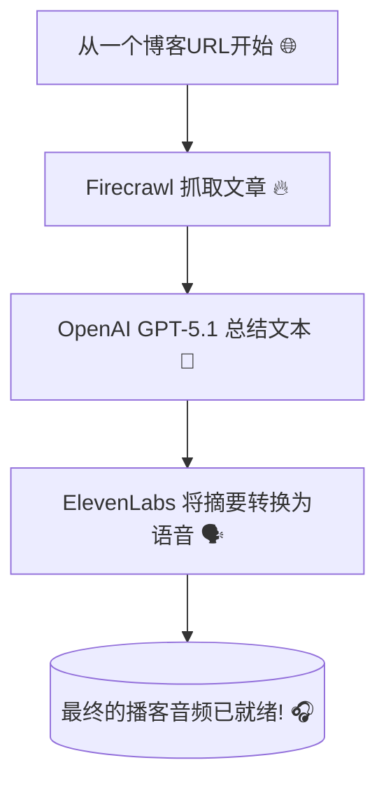

[English](README.md)

# AI 魔法：不到 100 行代码，把任意博客文章变成播客！🪄

如果我告诉你，用**不到100行Python代码**，你就能构建一个能阅读任何博客文章并将其转换成播客的AI，你会怎么想？✨ 这听起来像魔法，但它千真万确！

我想分享一个我最近捣鼓的有趣项目：**AI博客转播客代理 (AI Blog to Podcast Agent)**。它是一个极简的Web应用，你只需丢给它一个URL，几秒钟内就能得到一集可以直接收听的播客。🎧

---

---

## 揭秘“独家酱料”：仅需4种关键成分 🌶️

这个项目最令人难以置信的部分就是它的简洁性。它完全是站在巨人的肩膀上，通过几个强大的工具来完成所有繁重的工作。整个Web应用只有一个101行的Python文件！

这就是让魔法成为可能的技术栈：

-   **Streamlit** 🎈：构建Web界面的英雄。它让你能用纯Python构建交互式应用，完全不需要Web开发经验！
-   **Firecrawl** 🔥：可靠的数据“侦察兵”。它接收一个URL，智能地抓取文章内容，并清除所有垃圾信息（如广告和侧边栏）。
-   **OpenAI (GPT-5.1)** 🧠：才华横溢的“总结大师”。它会阅读抓取到的文本，并创作出一段简短、引人入胜且充满对话感的摘要——这正是我们播客的完美脚本。
-   **ElevenLabs** 🗣️：多才多艺的“配音演员”。这个API简直是魔法，能将我们的文本脚本转换成极其自然、逼真的人声。

## 幕后总指挥：`agno` 代理如何工作 🤖

那么，所有这些工具是如何协同工作，而不会变成一团乱麻的代码呢？答案就是 **`agno` 代理 (Agent)** 框架。

你可以把这个代理想象成一个聪明的项目经理。我们不会一步步地告诉它*该怎么做*。相反，我们只需：
1.  给它一个**目标** (例如：“根据这个URL创建一个播客摘要”)。
2.  给它一个**工具箱** (例如：用于网页抓取的 `Firecrawl`)。

然后，代理就会自己搞定剩下的一切！它看到URL，意识到需要先抓取内容，于是就自动从工具箱里拿出了 `Firecrawl` 工具。这是一种更智能的构建应用的方式，感觉不像是编程，更像是下达指令。

下面是工作流程的简单示意图：



## 快来看看这个应用吧！💻

它的用户界面超级简单。所有的魔法都浓缩在这个清爽的界面里。


## 魔法代码：全部101行 📜
为了证明它有多简单，这里是**完整**的Python脚本。从用户界面到AI代理逻辑，再到语音生成，所有的功能都在这一个文件里。

```python
import os
from uuid import uuid4
from agno.agent import Agent
from agno.run.agent import RunOutput
from agno.models.openai import OpenAIChat
from agno.tools.firecrawl import FirecrawlTools
from elevenlabs import ElevenLabs
import streamlit as st

# Streamlit Setup
st.set_page_config(page_title="📰 ➡️ 🎙️ Blog to Podcast", page_icon="🎙️")
st.title("📰 ➡️ 🎙️ Blog to Podcast Agent")

# API Keys (Runtime Input)
st.sidebar.header("🔑 API Keys")
# OpenAI API Compatible Model Settings
st.sidebar.subheader("OpenAI API Compatible Model")
openai_api_key = st.sidebar.text_input("API Key", type="password")
openai_base_url = st.sidebar.text_input("Base URL", value="https://api.openai.com/v1")
openai_model_id = st.sidebar.text_input("Model ID", value="gpt-5.1")
# Other API Keys
st.sidebar.subheader("Other Services")
elevenlabs_key = st.sidebar.text_input("ElevenLabs API Key", type="password")
firecrawl_key = st.sidebar.text_input("Firecrawl API Key", type="password")

st.sidebar.markdown("---")
st.sidebar.markdown("### Get your API Keys:")
st.sidebar.markdown("- [OpenAI API Keys](https://platform.openai.com/api-keys)")
st.sidebar.markdown("- [ElevenLabs](https://elevenlabs.io/)")
st.sidebar.markdown("- [Firecrawl](https://www.firecrawl.dev/)")

# Blog URL Input
url = st.text_input("Enter Blog URL:", "")

# Generate Button
if st.button("🎙️ Generate Podcast", disabled=not all([openai_api_key, elevenlabs_key, firecrawl_key])):
    if not url.strip():
        st.warning("Please enter a blog URL")
    else:
        with st.spinner("Scraping blog and generating podcast..."):
            try:
                # Set API keys
                os.environ["FIRECRAWL_API_KEY"] = firecrawl_key
                
                # Create agent for scraping and summarization
                agent = Agent(
                    name="Blog Summarizer",
                    model=OpenAIChat(
                        id=openai_model_id,
                        api_key=openai_api_key,
                        base_url=openai_base_url,
                    ),
                    tools=[FirecrawlTools()],
                    instructions=[
                        "Scrape the blog URL and create a concise, engaging summary (max 2000 characters) suitable for a podcast.",
                        "The summary should be conversational and capture the main points."
                    ],
                )
                
                # Get summary
                response: RunOutput = agent.run(f"Scrape and summarize this blog for a podcast: {url}")
                summary = response.content if hasattr(response, 'content') else str(response)
                
                if summary:
                    # Initialize ElevenLabs client and generate audio
                    client = ElevenLabs(api_key=elevenlabs_key)
                    
                    # Generate audio using text_to_speech.convert
                    audio_generator = client.text_to_speech.convert(
                        text=summary,
                        voice_id="JBFqnCBsd6RMkjVDRZzb",
                        model_id="eleven_multilingual_v2"
                    )
                    
                    # Collect audio chunks if it's a generator
                    audio_chunks = []
                    for chunk in audio_generator:
                        if chunk:
                            audio_chunks.append(chunk)
                    audio_bytes = b"".join(audio_chunks)
                    
                    # Display audio
                    st.success("Podcast generated! 🎧")
                    st.audio(audio_bytes, format="audio/mp3")
                    
                    # Download button
                    st.download_button(
                        "Download Podcast",
                        audio_bytes,
                        "podcast.mp3",
                        "audio/mp3"
                    )
                    
                    # Show summary
                    with st.expander("📄 Podcast Summary"):
                        st.write(summary)
                else:
                    st.error("Failed to generate summary")
                    
            except Exception as e:
                st.error(f"Error: {e}")
```

## 下一步可以做什么？🚀

这个百行代码的项目仅仅是个开始！这里有几个让它更上一层楼的想法：
-   **播放列表功能**：一次性转换多个URL，并创建一个播客播放列表。
-   **语音选择**：添加一个下拉菜单，用于从ElevenLabs选择不同的声音。
-   **语言翻译**：在生成音频之前，增加一个代理步骤来翻译文章。

这个项目极好地展示了现代AI工具如何让我们快速构建出强大的应用。它的核心在于创造性地将正确的服务组合在一起。

## 如何亲自运行它 🚀
准备好亲自试试了吗？在你的电脑上把它运行起来非常简单。

**1. 先决条件:**
-   确保你已经安装了 **Python 3.8+**。
-   你需要准备好以下服务的API密钥：
    -   [OpenAI](https://platform.openai.com/api-keys)
    -   [ElevenLabs](https://elevenlabs.io/)
    -   [Firecrawl](https://www.firecrawl.dev/)

**2. 安装步骤:**
首先，克隆项目仓库并安装所需的软件包。
```bash
# 克隆仓库 (请使用实际的项目URL)
git clone https://github.com/tongzm/ai_blog_to_podcast_agent.git

# 进入项目目录
cd ai_blog_to_podcast_agent

# 安装依赖
pip install -r requirements.txt
```

**3. 运行应用:**
使用以下命令启动Streamlit应用：
```bash
streamlit run app.py
```
你的浏览器会自动打开并运行该应用。只需在侧边栏粘贴你的API密钥，输入一个博客URL，你就可以生成第一个播客了！

想亲眼看看这100行代码的魔法吗？**去GitHub上看看这个项目吧！** (别忘了点个 ⭐ 哦)。